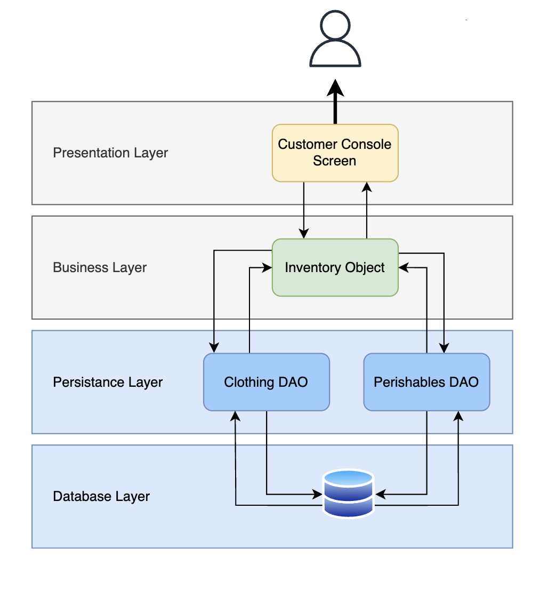
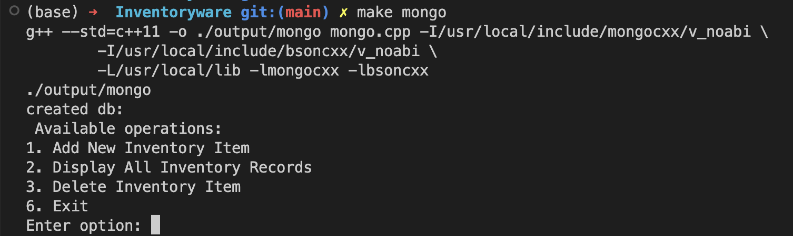
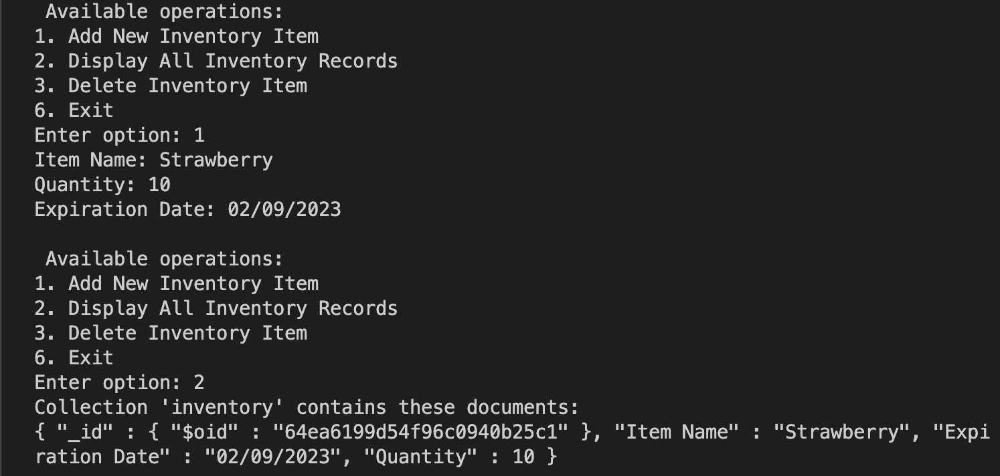
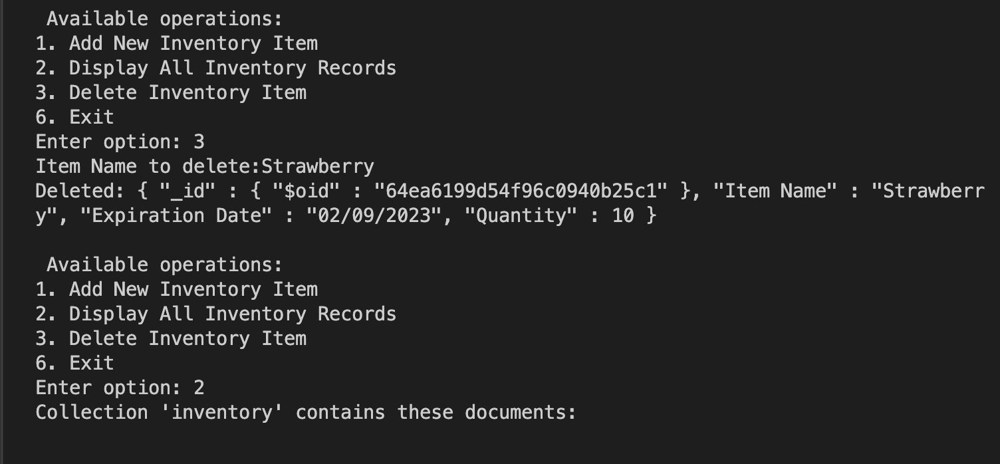

# Inventoryware

## Console Program Demo


## Tech Stack
- C++ console program (user-interface & backend)
- MongoDB (database)

## Inventory's Layered Architecture



## Running locally

#### Install dependencies
- mongocxx (guide for installing: https://mongocxx.org/mongocxx-v3/installation/)
- bsoncxx

#### Start Console Program
Create a folder called "output" with 
``` mkdir output ``` 
To compile the c++ program and start it, open terminal and run 
``` make mango ``` 
or 
```
g++ --std=c++11 -o ./output/mongo mongo.cpp -I/usr/local/include/mongocxx/v_noabi \
	-I/usr/local/include/bsoncxx/v_noabi \
	-L/usr/local/lib -lmongocxx -lbsoncxx
	./output/mongo
```



#### Add Item
Type option 1 to add items. Users will be prompted for the name, quantity, and expiration date of the items to be added.



#### Remove Item
Type option 3 to add items. Users will be prompted for the name of the item to be removed.



#### View Items
Type option 2 to view items current items in inventory as shown above.


## To Dos:
- [x] Basic CRUD Operations
- [ ] Inventory Items abstraction for better comparison between items
- [ ] Sorting inventory items
    - [ ] by expiry date
        - [ ] option to remove items with expiry date more than today
    - [ ] other columns 
    
References:
- https://github.com/mongodb/mongo-cxx-driver
- https://www.oreilly.com/library/view/software-architecture-patterns/9781491971437/ch01.html#:~:text=Although%20the%20layered%20architecture%20pattern,(Figure%201%2D1).
