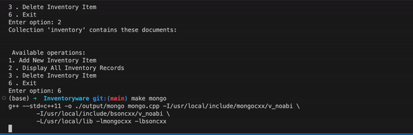

# Inventoryware

## Section 1: User's Console Program


## Tech Stack
- C++ console program (user-interface & backend)
- MongoDB (database)

## Inventory's Layered Architecture


## Running locally

#### Install dependencies
- mongocxx (guide for installing: https://mongocxx.org/mongocxx-v3/installation/)
- bsoncxx

#### Start Console Program
1. Create a folder called "output" with 
``` 
mkdir output 
``` 
2. To compile the c++ program and start it, open terminal and run 
``` 
make mango 
``` 
or 
```
g++ --std=c++11 -o ./output/mongo mongo.cpp -I/usr/local/include/mongocxx/v_noabi \
	-I/usr/local/include/bsoncxx/v_noabi \
	-L/usr/local/lib -lmongocxx -lbsoncxx
	./output/mongo
```


3. Add Item
Type option 1 to add items. Users will be prompted for the name, quantity, and expiration date of the items to be added.


4. Remove Item
Type option 3 to add items. Users will be prompted for the name of the item to be removed.


5. View Items
Type option 2 to view items current items in inventory as shown above.


## Section 2: Concurrency Operations

### Mulithreaded App Architecture 


### Design Considerations:
- To relieve hotspots in the program when multiple edits need to be made such as adding, deleting, editting 100 or more documents at once, concurrency can be used. 
- Concurrent operations require creating new threads. These threads are joined and deleted when the result of the task is fetched. Creating and closing threads can be a resource intensive process. Thus, having reusable threads that can be fetched from pools can be used. 
- A worker threadpool and a database connections threadpool are used to synchronise with each other and execute multiple transactions in database. 
- A thread safe queue was used in both thread pools to ensure race conditions of tasks are avoided. The thread safe queue was created using mutex to prevent two or more different threads from accessing the same task queue. A possible race condition might be two threads executing the same popped task, resulting in the task getting executed twice such as a bank transaction of deducting $100 from user being done twice. 
- Having more threads than hardware cores results in each core taking more than 1 thread. With each core handling 2 or more threads, it can result in context switching, another memory intensive process. Thus, to prevent this, an amount equivalent to the number of hardware cores were used.
- Each worker pool thread only needs one database connection. Thus, an equivalent number of postgresql database connection threads were created in database pool. 
- Postgresql was used instead of mongodb due to library incompatibility issues that prevents fetching multiple mongodb connections as needed.

## Tech Stack
- C++ console program (user-interface & backend)
- Postgresql (database)

## Running locally

1. Create a folder called "output" with 
```
mkdir output
``` 

2. To start the postgresql database, run 
```
docker compose up
``` 

3. To compile the c++ program and start it, open terminal and run 
```
make postgres_threadpool
``` 


## To Dos:
- [x] Basic CRUD Operations
- [x] Inventory as a Business Layer
- [ ] Items abstraction for better comparison between items
- [ ] Sorting inventory items
    - [ ] by expiry date
        - [ ] option to remove items with expiry date more than today
    - [ ] other columns 
- [ ] Add CPU performance profiler and race condition detector(race_detector) for better analysis

References:
- https://github.com/mongodb/mongo-cxx-driver
- https://www.oreilly.com/library/view/software-architecture-patterns/9781491971437/ch01.html#:~:text=Although%20the%20layered%20architecture%20pattern,(Figure%201%2D1).
- https://medium.com/@extio/microservices-with-c-scalable-software-architecture-for-modern-development-a1bbe766e41a
- https://levelup.gitconnected.com/a-universal-connection-pool-written-in-c-6f4f14a98a9e 
- https://www.codeproject.com/Articles/16960/Connection-Pool-in-a-Static-Library
- https://github.com/active911/connection-pool/blob/master/ConnectionPool.h
- https://github.com/sewenew/redis-plus-plus/blob/master/src/sw/redis%2B%2B/async_connection_pool.cpp
- http://mongocxx.org/api/mongocxx-3.2.0/pool_8hpp_source.html
- https://levelup.gitconnected.com/a-universal-connection-pool-written-in-c-6f4f14a98a9e 
- https://stackoverflow.com/questions/6508037/postgres-connection-pooling-library
- https://arctype.com/blog/connnection-pooling-postgres/ 
- https://github.com/joegsn/uvpgpool/blob/master/uvpgpool/UVPGPool.cpp

C++ Methods Specific:
- https://www.scaler.com/topics/unordered_map-cpp/

Profiling CPU utilisation by program:
- https://stackoverflow.com/questions/11445619/profiling-c-on-mac-os-x 
- https://go.dev/doc/articles/race_detector
